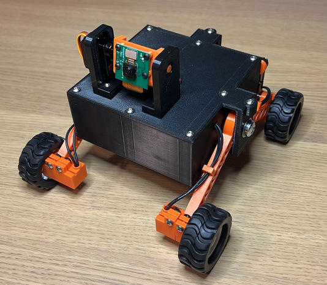
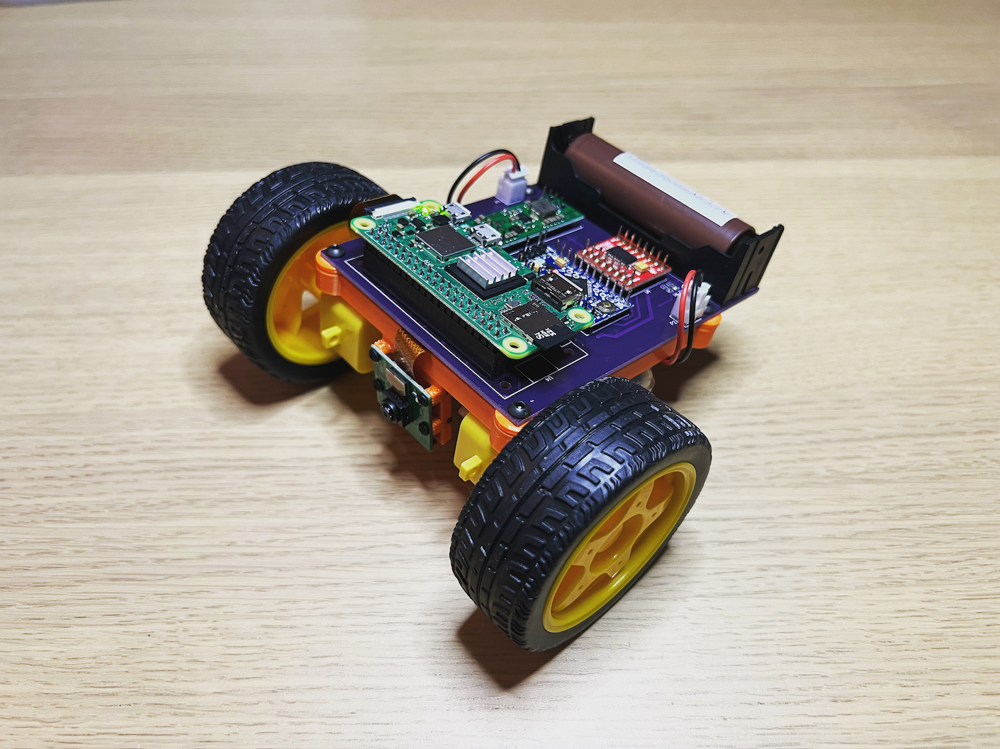

# Examples of robots built with roboportal

## How-to

[Video guide on integrating a robot with the roboportal.](https://www.youtube.com/channel/UC-CswhfCJ-i4M9BcoTOE9oA)

## Rovy

### Description

Simple robot with rocker suspension and power management system.

### Build files:

- [PCB](https://oshwlab.com/dmalykhin/home-bot)
- [Models to 3d print](https://www.thingiverse.com/thing:5449201)

### How it works:

## IPC

Minimalistic example of inter process communication with [ZeroMQ](https://zeromq.org/). The way to integrate with ROS and etc.

## Sneaky

### Description

Minimalistic robot design for the indoor fun.

### Build files:

- [PCB](https://oshwlab.com/dmalykhin/sneaky)
- [Models to 3d print](https://www.thingiverse.com/thing:5142429)

### How it works:

## Warbots

### Description

Expired by battle bots. To get an idea what is that check the preview below:

### Build files:

- [RF dongle PCB](https://oshwlab.com/dmalykhin/dongle_v2)
- [Warbot controller PCB](https://oshwlab.com/dmalykhin/bot_v2)
- [Models to 3d print](https://www.thingiverse.com/thing:4923396)

## Scout

### Description

Remote controlled vehicle.
Read the full story [here](https://www.thingiverse.com/thing:4948956)

### Build files:

- [Scout controller PCB](https://oshwlab.com/dmalykhin/scout)
- [Models to 3d print](https://www.thingiverse.com/thing:4948956)

## Telemetry

### Description

The communication between the robot and the user's UI is bidirectional. Data, that could be streamed from the robot to the application and presented on optional widgets:

- GPS coordinates and magnetic heading displayed on the map
- battery voltage

### Build files:

- [Controller PCB with bn-880](https://oshwlab.com/dmalykhin/scout_copy_copy)

## HEXBUG BattleBots

### Description

A simple way to play [BattleBots](https://www.hexbug.com/battlebots) online. Toys are remotely controlled over IR with some custom protocol (at least it didn't match existing ones at first glance). Signal is modulated with 38 kHz. The example of 'move forward' command for the robot with address '0':

#### Timings

- 'start' bit ~ 1.7 ms
- 'pause' and '0' ~ 0.3 ms
- '1' ~ 1 ms

#### Commands

- stop 0b00000
- forward 0b10000
- left 0b01000
- right 0b00100
- backward 0b00010
- weapon 0b00001

#### Addresses

There are 4 addresses available (0b00 - 0b11)

#### Parity bit

Parity bit is calculated by counting '1' in command and address. The value is '1' if the counter is odd.

#### Hardware

IR led is connected to Arduino (nano in this case) D2 pin thru current limiting resistor 150R.
