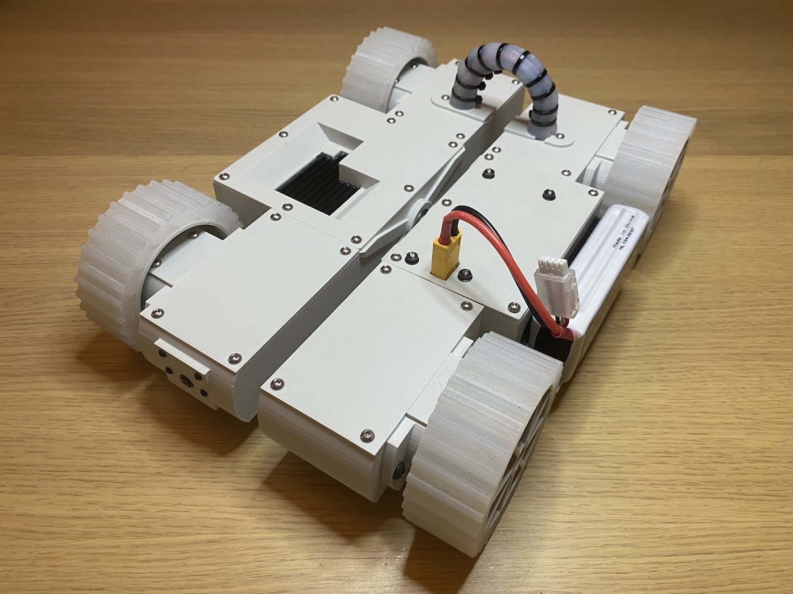
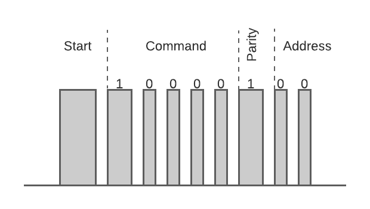

# Example of robots built with roboportal

## Warbots

### Description
Expired by battle bots. To get an idea what is that check the preview below:

### Build files:
- [RF dongle PCB](https://oshwlab.com/dmalykhin/dongle_v2)
- [Warbot controller PCB](https://oshwlab.com/dmalykhin/bot_v2)
- [Models to 3d print](https://www.thingiverse.com/thing:4923396)

## Scout

### Description
Remote controlled vehicle.
Read the full story [here](https://www.thingiverse.com/thing:4948956)

### Build files:
- [Scout controller PCB](https://oshwlab.com/dmalykhin/scout)
- [Models to 3d print](https://www.thingiverse.com/thing:4948956)

## HEXBUG BattleBots

### Description
A simple way to play [BattleBots](https://www.hexbug.com/battlebots) online. Toys are remotely controlled over IR with some custom protocol (at least I didn't find anything like that). Signal is modulated with 38 kHz. The example of 'move forward' command for the robot with address '0':

#### Timings
 - 'start' bit ~ 1.7 ms
 - 'pause' and '0' ~ 0.3 ms
 - '1' ~ 1 ms

#### Commands

- stop     0b00000
- forward  0b10000
- left     0b01000
- right    0b00100
- backward 0b00010
- weapon   0b00001

#### Addresses

There are 4 addresses available (0b00 - 0b11)

#### Parity bit

Parity bit is calculated by counting '1' in  command and address. The value is '1' if the sun is odd.

#### Hardware

IR led is connected to Arduino (nano in my case) D2 pin thru current limiting resistor 150R. 
